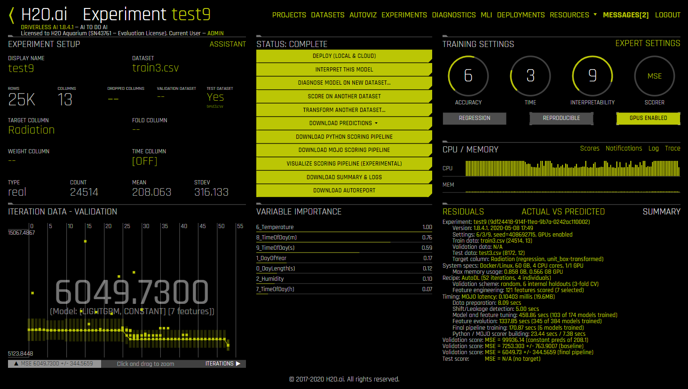

# Solar Energy Prediction datamex0320

The dataset contains columns such as wind speed and direction, humidity or temperature. The competition is to predict solar radiation based on those data. There are 4 months of data.

The error metric is the MSE, therefore, the lower the better the result.

The units of each column are:

Radiation: Solar radiation in watts per meter ^ 2
Temperature: Temperature in degrees Fahrenheit
Humidity: Humidity in%
Pressure: Atmospheric pressure in mm Hg
WindDirection (degrees): Wind direction in degrees
Speed: Wind speed in miles per hour
Sunrise / sunset: Sunrise-Sunset (Hawaii time)
UNIXTime: TimeStamp (seconds from 01-01-1970)
Date: Date
Time: Time

----------------------------------------------------------------------------------------------------------------------------------------------------------------------------------------------------------------------------------------------------------------------------------------

## Stage 1

Cleaning data: 

In the file "Main_data_cleaning.ipynb" Data column is transformed by hour, day, week.
Files "test4.csv" and "train4.csv" are generated. 

## Stage 2

Some test "by hand":

In the file "Main_data_cleaning.ipynb" are contained some tests with different regression models.
Teorically the best model trained was the CatBoostRegressor with MSE = 5996.870630549922 but kaggle score sumission raised to 10000.

## Stage 3

Next step H2O.ai Acuarium dashboard tests:

We can see the image 

1.- Loading both files generated stage 1.
2.- Selecting "train4.csv" to train the model, the target column is "Radiation"
3.- Selecting "test4.csv" to make predictions, this dataset does not contai "Radiation" column
4.- Training the model and downloading experiment predicctions.

Finally the MSE obtained is close to 6000 but kaggle score sumission stayed at 6395.05063.

## Stage 4

Regression Tutorial.
https://github.com/pycaret/pycaret/blob/master/Tutorials/Regression%20Tutorial%20Level%20Beginner%20-%20REG101.ipynb

Experimentation with PyCaret file "Main_PyCaret_Regression.ipynb":

We can appreciate graphics of the best three models Extra Trees Regressor, Random Forest, and Light Gradient Boosting Machine.
Some tries to improve models were taken but the best model was Extra Trees Regressor (train R**2 = 1, test r**2 = 0.929).

MSE = 6987.145

----------------------------------------------------------------------------------------------------------------------------------------------------------------------------------------------------------------------------------------------------------------------------------------

# Results of the competition

Kaggle link:
https://www.kaggle.com/c/solar-energy-prediction-datamex0320/leaderboard
4st place

